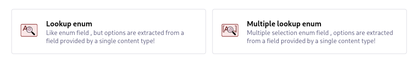
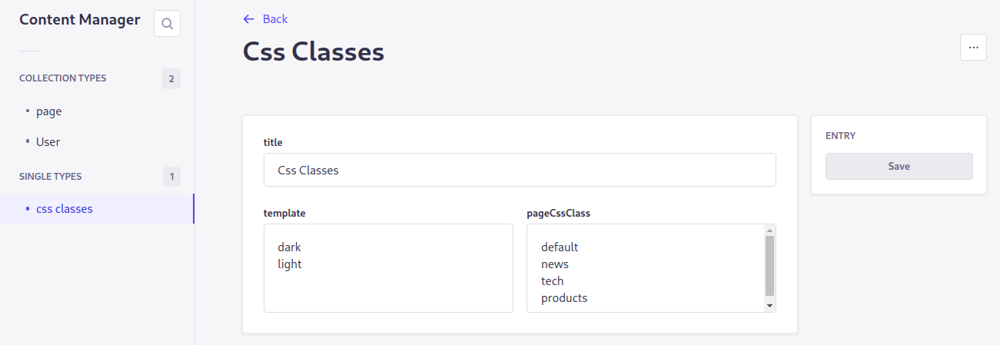
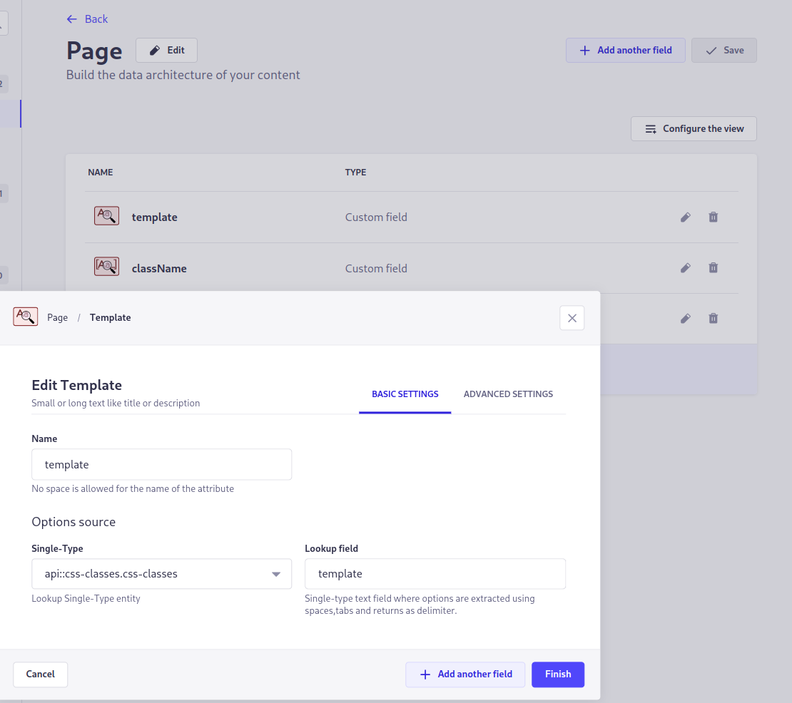
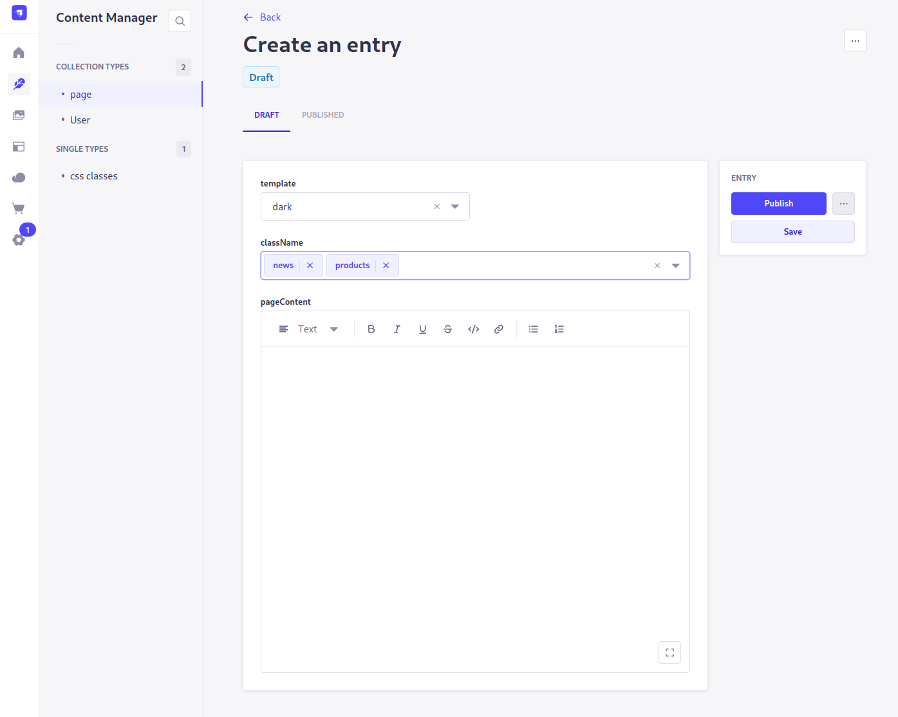

# Strapi plugin lookup-enum

A strapi plugin that adds custom fields similar to the enum field, but values are extracted from a field provided by a single-type content, so options are dynamic.

These two component have been created to satisfy all those cases where you need to
set one value string or a group of them from a dynamic set.

Without these two component you would generally need a collection type for every
field and link with a relation, definitely not very efficient when you have to deal with simple cases.

These two field types simplifies this design parsing text from fields in a selected single-type entity.

For `lookup-enum` field the value will be a string, while for `multi-lookup-enum` the value will be an array of stings.

### CHANGELOG

**1.0.0**

- First release

## Installation

To install this plugin, you need to add an NPM dependency to your Strapi application:

```
# Using Yarn
yarn add @turbo-red/strapi-plugin-lookup-enum

# Or using NPM
npm install @turbo-red/strapi-plugin-lookup-enum
```

Then, you'll need to build your admin panel:

```
# Using Yarn
yarn build

# Or using NPM
npm run build
```

## Usage

After installation you will find the **lookup-enum** and **multi-lookup-enum** in the custom fields section of the content-type builder.



Suppose you have to create a collection-type to store data for html pages and you want to be able to define a custom template and a set of css classes for each item.

First create a single-type entity with two text fields that you can fill like in the example below:



Then define a `Page` collection-type in the content-type builder:

Add a `lookup-enum` custom field and name it `template`.\
Select `api::css-classes.css-classes`from the Single-Type field in the Options
Source, then write `template` as the name of the field you want to become the lookup source field.

Add a `multi-lookup-enum` too, this time write `pageCssClass` as lookup source field.

Finally add a content and all the fields you need for your `Page` collection-type.



When you edit page entries in `Content Manager` you will find a form similar to the following:



As you can see entries are selected from the `css-classes` parsed fields.

### And that's all, happy coding!
